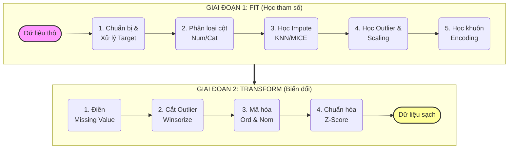

# Sơ đồ Luồng xử lý DataPipeline

Sơ đồ được thiết kế với **2 hàng ngang** (Sử dụng `flowchart` để đảm bảo hiển thị đúng bố cục trên các trình xem hiện đại).

### Tại sao sơ đồ này hiển thị tốt trong LaTeX?
1.  **Cấu trúc 2 hàng**: Thay vì một dải dài dằng dặc, sơ đồ được chia đôi. `Giai đoạn 1` ở trên, `Giai đoạn 2` ở dưới.
2.  **Sử dụng `flowchart`**: Đây là phiên bản mới hơn của `graph`, hỗ trợ tốt hơn việc quy định hướng (`direction LR`) bên trong từng khối (subgraph).
3.  **Mũi tên nối dày (`==>`)**: Tạo ra sự phân cấp rõ ràng giữa việc hoàn tất quá trình "Học" và bắt đầu quá trình "Biến đổi".
4.  **Bố cục cân đối**: Giúp hình ảnh khi chèn vào LaTeX không bị co quá nhỏ chiều ngang, giữ cho chữ luôn dễ đọc.
